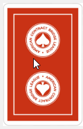
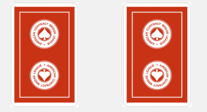
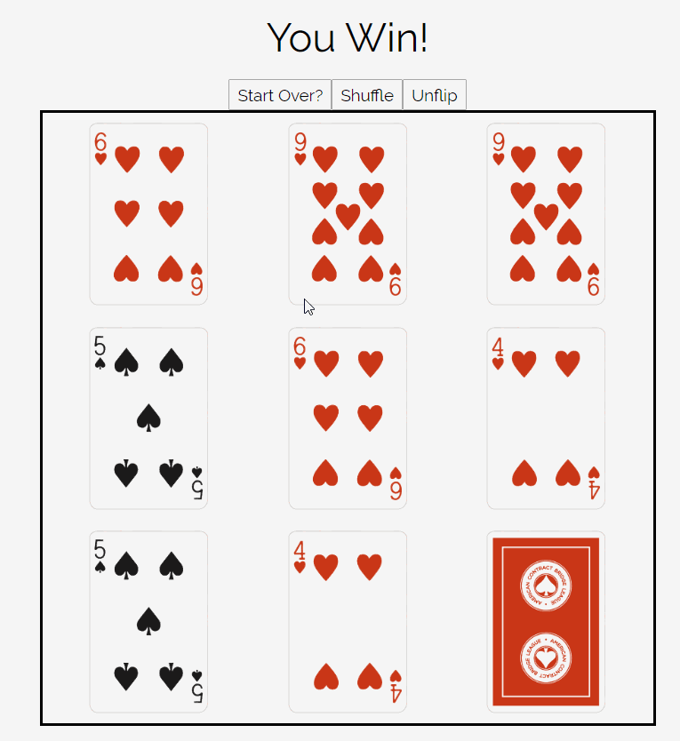

# How To Play

## Clicking Cards

### Step 1: Click a card

When you select a card, it will be flipped over.

### Step 2: Find the matching card

**If they match, the cards will stay flipped over. Otherwise, they will flip back**

### Step 3: Continue to match cards until you find all available pairs

### Step 4: 🎉🎉🎉 Confetti 🎉🎉🎉

### Step 5: If you want to play again, just click "Start Over"

### Step 6: Repeat
